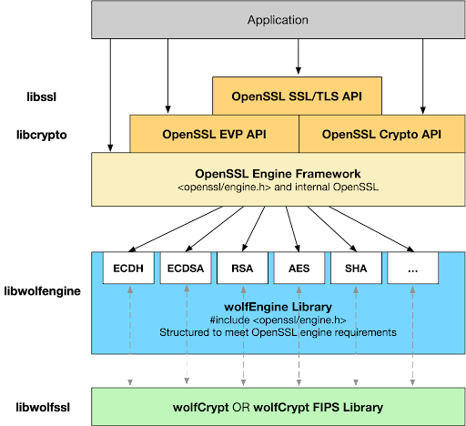

# Introduction

The wolfCrypt Engine (wolfEngine) is an OpenSSL engine for the wolfCrypt and wolfCrypt FIPS cryptography libraries. wolfEngine provides an OpenSSL engine implementation, as a shared or static library, to allow applications currently using OpenSSL to leverage wolfCrypt cryptography for FIPS and non-FIPS use cases.

wolfEngine is structured as a separate standalone library which links against wolfSSL (libwolfssl) and OpenSSL. wolfEngine implements and exposes an **OpenSSL engine implementation** which wraps the wolfCrypt native APIinternally. A high-level diagram of wolfEngine and how it relates to applications and OpenSSL is displayed below in Figure 1.

For more details on the design and architecture of wolfEngine see the [wolfEngine Design](chapter09.md) chapter.

wolfEngine is compiled by default as a shared library called **libwolfengine** which can be dynamically registered at runtime by an application or OpenSSL through a config file. wolfEngine also provides an entry point for applications to load the engine when compiled in a static build.
