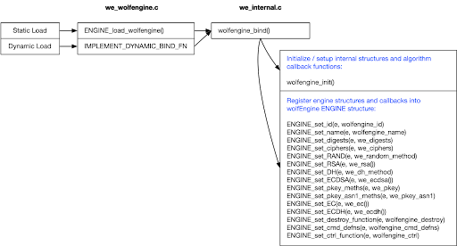

# wolfEngine Design

wolfEngine is composed of the following source files, all located under the “src” subdirectory of the wolfEngine package.

| Source File | Description |
| --------------- | ---------------- |
| we_wolfengine.c | Contains library entry points. Calls OpenSSL IMPLEMENT_DYNAMIC_BIND_FN for dynamic loading of the library using the OpenSSL engine framework. Also includes static entry points when compiled and used as a static library. |
| we_internal.c | Includes wolfengine_bind() function, which handles registration of engine algorithm callbacks. Also includes other wolfengine internal functionality. |
| we_logging.c | wolfEngine logging framework and function implementations. |
| we_openssl_bc.c | wolfEngine OpenSSL binary compatibility abstraction layer, used for supporting wolfEngine across multiple OpenSSL versions. |
| we_aes_block.c | wolfEngine AES-ECB and AES-CBC implementation. |
| we_aes_cbc_hmac.c | wolfEngine AES-CBC-HMAC implementation. |
| we_aes_ccm.c | wolfEngine AES-CCM implementation. |
| we_aes_ctr.c | wolfEngine AES-CTR implementation. |
| we_aes_gcm.c | wolfEngine AES-GCM implementation. |
| we_des3_cbc.c | wolfEngine 3DES-CBC implementation. |
| we_dh.c | wolfEngine DH implementation. |
| we_digest.c | wolfEngine message digest implementations (SHA-1, SHA-2, SHA-3). |
| we_ecc.c | wolfEngine ECDSA and ECDH implementation. |
| we_mac.c | wolfEngine HMAC and CMAC implementations. |
| we_random.c | wolfEngine RAND implementation. |
| we_rsa.c | wolfEngine RSA implementation. |
| we_tls_prf.c | wolfEngine TLS 1.0 PRF implementation. |


General wolfEngine architecture is as follows, showing both dynamic and static entry points:



## wolfEngine Entry Points

The main entry points into the wolfEngine library are either **wolfengine_bind** () or **ENGINE_load_wolfengine** (). wolfengine_bind() is called automatically by OpenSSL if wolfEngine has been loaded dynamically. ENGINE_load_wolfengine() is the entry point applications must call if wolfEngine has been built and used statically instead of dynamically.

## wolfEngine Algorithm Callback Registration

wolfEngine registers algorithm structures and callbacks with the OpenSSL engine framework for all supported components of wolfCrypt FIPS. This registration happens inside `wolfengine_bind()` in `we_internal.c`. `wolfengine_bind()` receives an ENGINE structure pointer
representing the wolfEngine engine. Individual algorithm/component callbacks or structures are then registered with that ENGINE structure using the appropriate API from <openssl/engine.h>.

These API calls include the following:
```
ENGINE_set_id(e, wolfengine_id)
ENGINE_set_name(e, wolfengine_name)
ENGINE_set_digests(e, we_digests)
ENGINE_set_ciphers(e, we_ciphers)
ENGINE_set_RAND(e, we_random_method)
ENGINE_set_RSA(e, we_rsa())
ENGINE_set_DH(e, we_dh_method)
ENGINE_set_ECDSA(e, we_ecdsa())
ENGINE_set_pkey_meths(e, we_pkey)
ENGINE_set_pkey_asn1_meths(e, we_pkey_asn1)
ENGINE_set_EC(e, we_ec())
ENGINE_set_ECDH(e, we_ecdh())
ENGINE_set_destroy_function(e, wolfengine_destroy)
ENGINE_set_cmd_defns(e, wolfengine_cmd_defns)
ENGINE_set_ctrl_function(e, wolfengine_ctrl)
```

Each algorithm/component callback function or structure used in the above calls (ex: we_digests, we_ciphers, etc) are implemented in either `we_internal.c` or in the respective algorithm source file.
